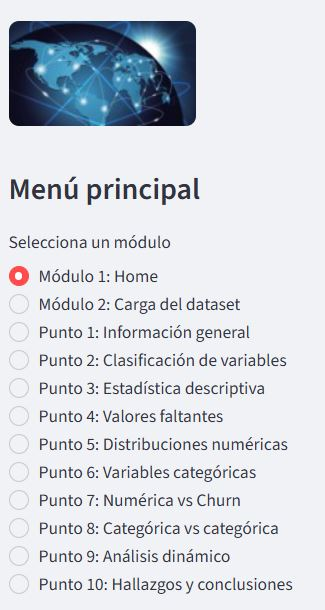

# Proyecto Final: Análisis Exploratorio de Datos — Telco Customer Churn

## 1. Descripción del proyecto

Este proyecto desarrolla una aplicación interactiva para realizar un análisis exploratorio de datos (EDA) sobre clientes de una empresa de telecomunicaciones.

El objetivo es examinar las características de los clientes, revisar la calidad de los datos e identificar patrones relacionados con la deserción del servicio (*Churn*).

La aplicación permite explorar las variables mediante estadísticas descriptivas, tablas, gráficos y comparaciones entre las características de los clientes.

### Análisis desarrollados

* Información general y estructura del dataset.
* Clasificación de variables numéricas y categóricas.
* Estadística descriptiva.
* Identificación de valores faltantes.
* Distribución de variables numéricas.
* Análisis de variables categóricas.
* Comparación de variables numéricas con Churn.
* Relación entre variables categóricas.
* Análisis dinámico mediante controles interactivos.
* Visualización de hallazgos y conclusiones.

## 2. Tecnologías utilizadas

* **Python:** lenguaje de programación.
* **Pandas y NumPy:** preparación y análisis de datos.
* **Matplotlib y Seaborn:** visualización de información.
* **Streamlit:** desarrollo de la aplicación web interactiva.
* **GitHub:** almacenamiento y control de versiones del proyecto.
* **Streamlit Community Cloud:** despliegue de la aplicación web.

## 3. Estructura del repositorio

```text
proyectofinal/
├── app1.py
├── TelcoCustomerChurn.csv
├── requirements.txt
├── README.md
├── imagen1.jpg
├── internet.jpg
├── Sidebar.jpg
├── disvarcat.JPG
└── disvarnum.JPG
```

## 4. Capturas de la aplicación

### 4.1. Página principal y menú de navegación



### 4.2. Distribución de variables categóricas


### 4.3. Distribución de variables numéricas


## 5. Instrucciones de ejecución

### Requisitos previos

* Python 3.10 o una versión compatible con las dependencias.
* Git, si deseas clonar el repositorio.
* El archivo `TelcoCustomerChurn.csv`.

### Paso 1. Clonar el repositorio

```bash
git clone https://github.com/marlonrojasn/proyectofinal.git
```

### Paso 2. Ingresar a la carpeta del proyecto

```bash
cd proyectofinal
```

### Paso 3. Instalar las dependencias

```bash
pip install -r requirements.txt
```

### Paso 4. Ejecutar la aplicación

```bash
streamlit run app1.py
```

Streamlit abrirá la aplicación en el navegador. Si no lo hace automáticamente, ingresa a la dirección local que aparece en la terminal, normalmente `http://localhost:8501`.

### Paso 5. Cargar los datos

Selecciona el módulo de carga y utiliza el botón para subir el archivo `TelcoCustomerChurn.csv`. Una vez cargado, podrás navegar por los módulos de análisis.

## 6. Enlaces relevantes

* **Repositorio del proyecto:** [GitHub — proyectofinal](https://github.com/marlonrojasn/proyectofinal)
* **Código fuente:** [app1.py](https://github.com/marlonrojasn/proyectofinal/blob/main/app1.py)
* **Aplicación web:** [Telco Customer Churn — Streamlit](https://proyectofinal-marlonrojas.streamlit.app/)
* **Documentación oficial de Streamlit:** [docs.streamlit.io](https://docs.streamlit.io/)

## 7. Autor

**Marlon Jerson Rojas Novoa**

Especialización en Data Science — 2026.

## 8. Consideraciones finales

El proyecto permite aplicar herramientas de programación y análisis de datos para explorar información, reconocer patrones y presentar resultados de forma visual e interactiva.

Las conclusiones se basan en los datos observados y tienen un enfoque descriptivo. Las asociaciones identificadas no implican necesariamente relaciones de causalidad ni constituyen predicciones de comportamiento futuro.
